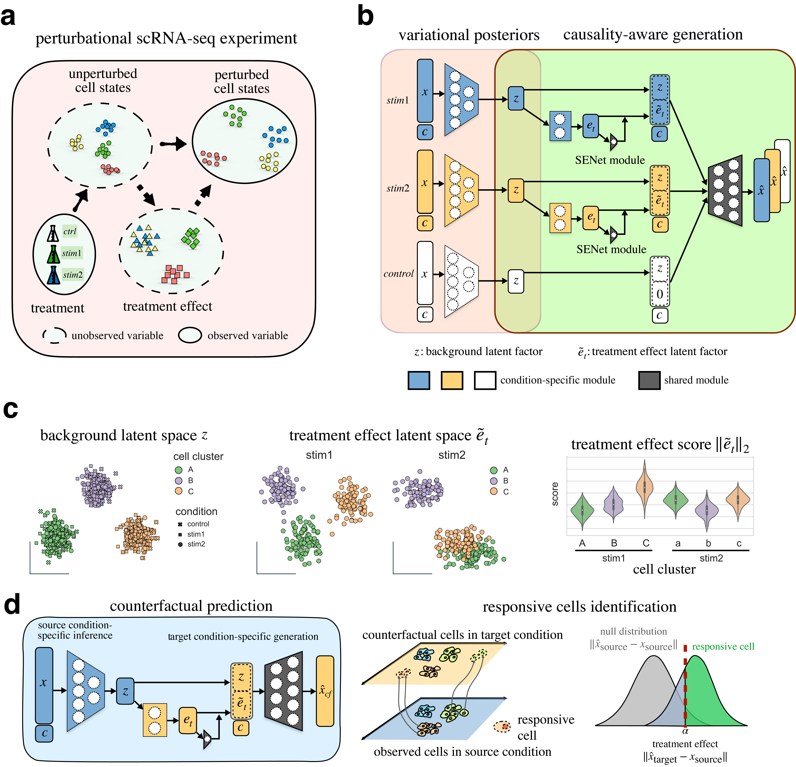

scCausalVI
======================================
scCausalVI is a causality-aware generative model for analyzing perturbational single-cell RNA sequencing data. The model addresses a fundamental challenge in single-cell analysis: disentangling intrinsic cellular heterogeneity from treatment-induced effects.
By incorporating structural causal modeling with deep learning, scCausalVI:

- Learns interpretable latent representations that separate baseline cellular states from treatment effects
- Models cell-state-specific responses through adaptive scaling mechanisms
- Enables in silico prediction of cellular states under alternative experimental conditions
- Integrates multi-source data while distinguishing technical variations from biological signals
- Identifies treatment-responsive populations and characterizes molecular signatures of susceptibility

The framework supports comprehensive downstream analyses, including clustering, differential expression, and cross-condition prediction, providing researchers with tools to investigate cellular heterogeneity and treatment responses at single-cell resolution.

.. toctree::
   :maxdepth: 2
   :caption: Contents:

   self
   installation
   tutorial
   api

.. include:: README.md
   :parser: myst_parser.sphinx_
